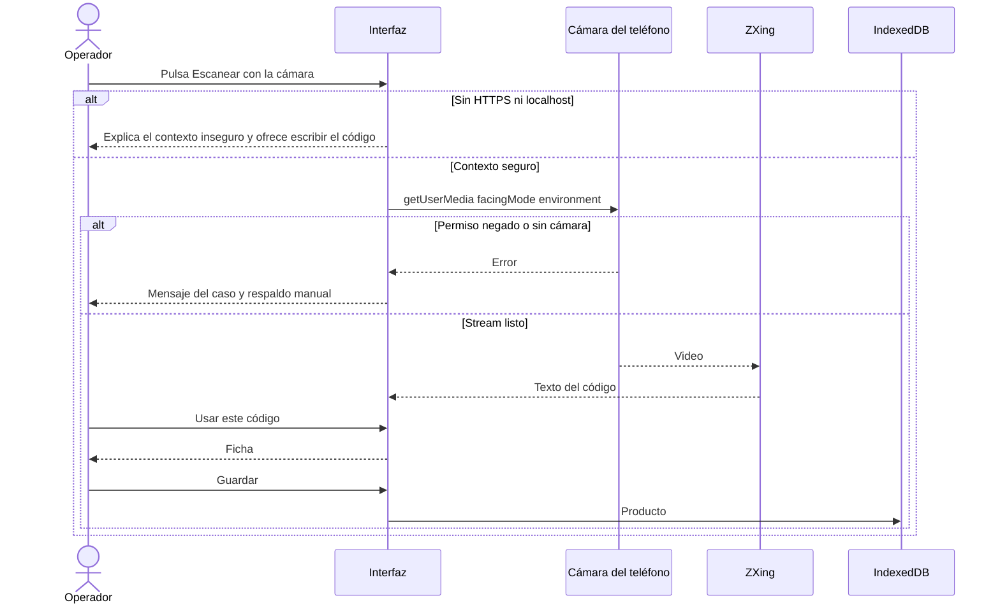

# Secuencia — escanear y guardar

```mermaid
sequenceDiagram
  actor Op as Operador
  participant UI as Interfaz
  participant Cam as Cámara del teléfono
  participant Dec as ZXing
  participant DB as IndexedDB
  Op->>UI: Pulsa Escanear con la cámara
  alt Sin HTTPS ni localhost
    UI-->>Op: Explica el contexto inseguro y ofrece escribir el código
  else Contexto seguro
    UI->>Cam: getUserMedia facingMode environment
    alt Permiso negado o sin cámara
      Cam-->>UI: Error
      UI-->>Op: Mensaje del caso y respaldo manual
    else Stream listo
      Cam-->>Dec: Video
      Dec-->>UI: Texto del código
      Op->>UI: Usar este código
      UI-->>Op: Ficha
      Op->>UI: Guardar
      UI->>DB: Producto
    end
  end
```

El código escrito a mano entra en la misma ficha, sin pasar por la cámara.
