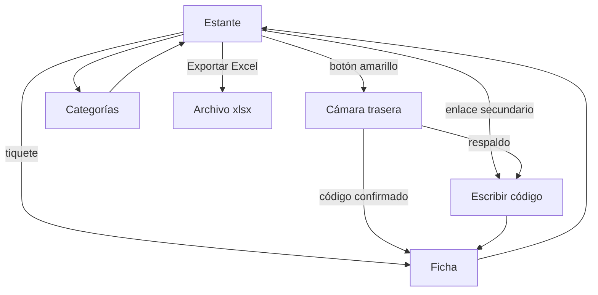

# Mapa de navegación

```mermaid
flowchart TD
  estante[Estante]
  cam[Cámara trasera]
  manual[Escribir código]
  ficha[Ficha]
  cats[Categorías]
  estante -->|botón amarillo| cam
  estante -->|enlace secundario| manual
  estante --> cats
  estante -->|tiquete| ficha
  cam -->|código confirmado| ficha
  cam -->|respaldo| manual
  manual --> ficha
  ficha --> estante
  cats --> estante
  estante -->|Exportar Excel| archivo[Archivo xlsx]
```

No hay rutas de URL. Es una sola página. Volver siempre regresa al estante y apaga la cámara.
